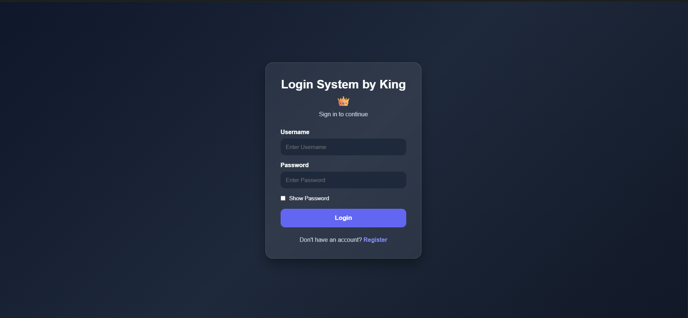
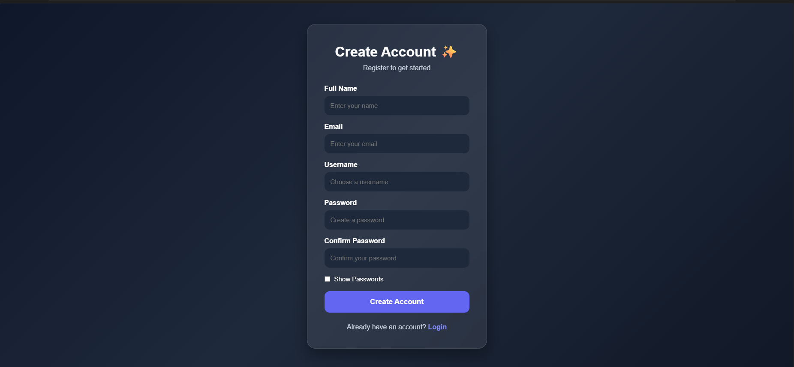
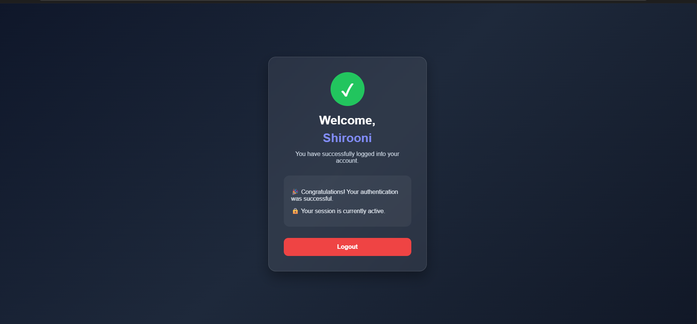
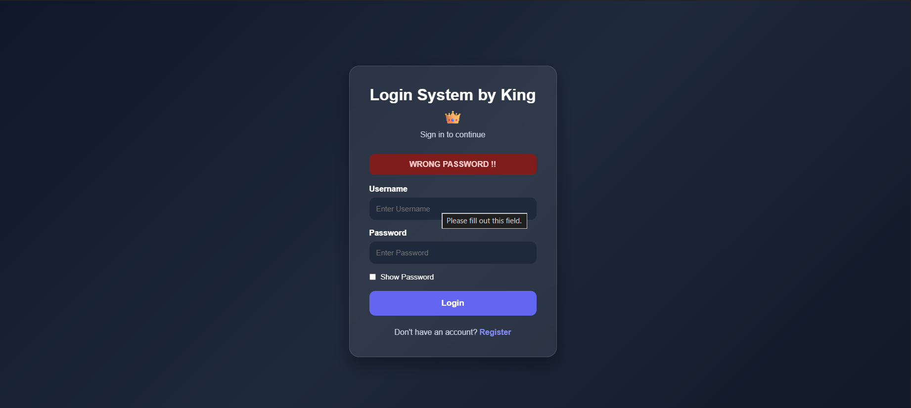
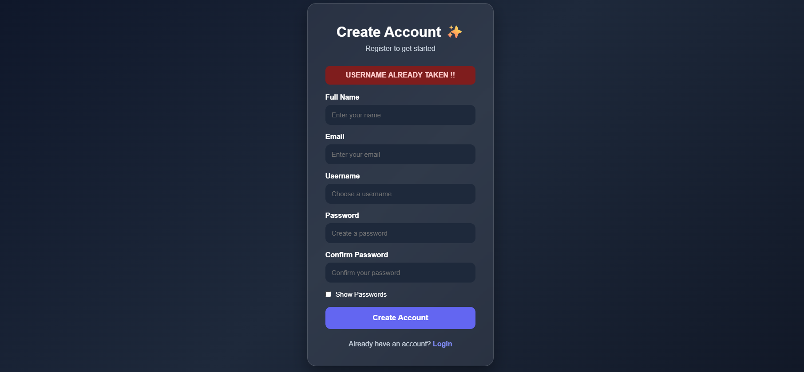

# 🔐 Flask Login System

A modern authentication system built with **Flask** and **SQLite**.

This project demonstrates the fundamentals of user authentication, including registration, login, password hashing, session management, and protected routes.

---

## ✨ Features

- 👤 User Registration
- 🔑 User Login
- 🔒 Password Hashing using Werkzeug
- 💾 SQLite Database
- 🚫 Duplicate Username Validation
- ✅ Confirm Password Validation
- 📋 Session Management
- 🛡 Protected Dashboard
- 🚪 Logout Functionality
- 📱 Responsive Modern UI

---

## 🛠 Tech Stack

- Python
- Flask
- SQLite
- HTML5
- CSS3
- JavaScript
- Werkzeug Security

---

## 📂 Project Structure

```
Login-System/
│
├── app.py
├── database.py
├── requirements.txt
├── .gitignore
│
├── templates/
│   ├── index.html
│   ├── regeister.html
│   └── dashboard.html
│
├── static/
│   └── style.css
│
└── database.db (generated locally)
```

---

## 📸 Screenshots

### Login Page


 > 

---

### Register Page


> 

---

### Dashboard

> 

---

### ❌ Wrong Password

> 

---

### 🚫 Username Already Taken

> 

---

## 🚀 Installation

### Clone the repository

```bash
git clone https://github.com/your-username/your-repository.git
```

### Move into the project

```bash
cd your-repository
```

### Install dependencies

```bash
pip install -r requirements.txt
```

### Create the database

```bash
python database.py
```

### Run the application

```bash
python app.py
```

---

## 📚 What I Learned

- Flask Routing
- GET & POST Requests
- HTML Forms
- Session Management
- User Authentication
- Password Hashing
- SQLite Database Operations
- CRUD Basics
- Responsive UI Design

---

## 🌟 Future Improvements

- Email Validation
- Forgot Password
- Password Strength Meter
- Profile Page
- Remember Me Option
- User Profile Picture
- Email Verification

---

## 📄 License

This project is created for learning purposes.
